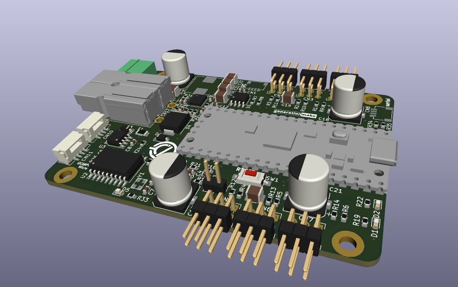
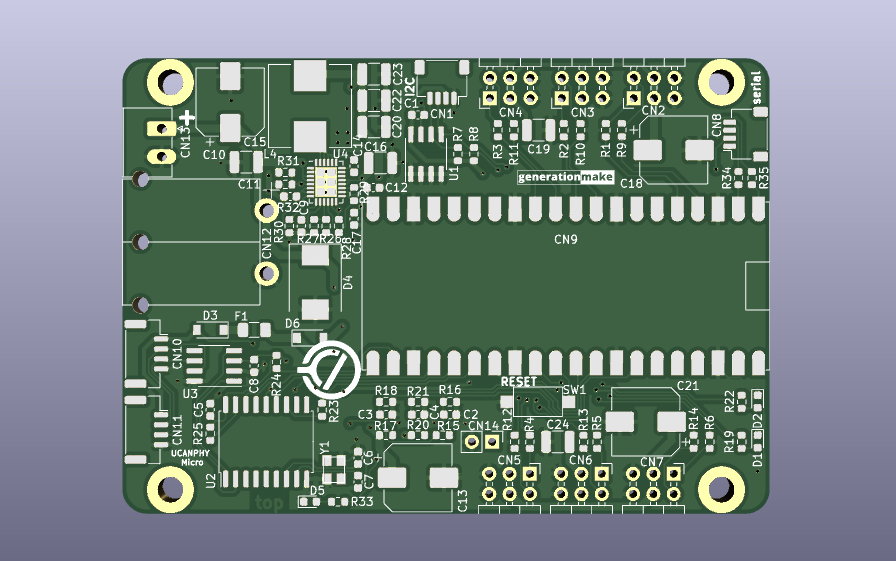
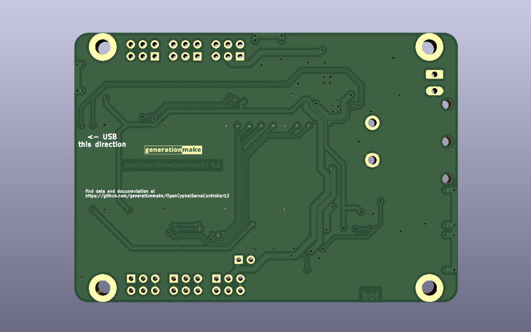

# CyphalServoController12/CAN
Board to control up to 12 servos with a Raspberry Pi Pico to connect via CAN using OpenCyphal and UCANPHY Micro

## Description

### analog measurements

| **channel** | **usage**       | **range**  |
|:-----------:|:---------------:|:----------:|
| ADC0        | battery voltage | 0 - 66 V   |
| ADC1        | servo voltage   | 0 - 6.6 V  |
| ADC2        | CAN bus voltage | 0 - 6.6 V  |

### power supply

The power for the microcontroller and the CAN interface can be fed via the CAN connector or thepower regulator for the servos. The power regulator for the servos can be enabled and disabled by the microcontroller to save power in stand-by.

input voltage: 10 - 40 V

## PCB

### Top

### Bottom

